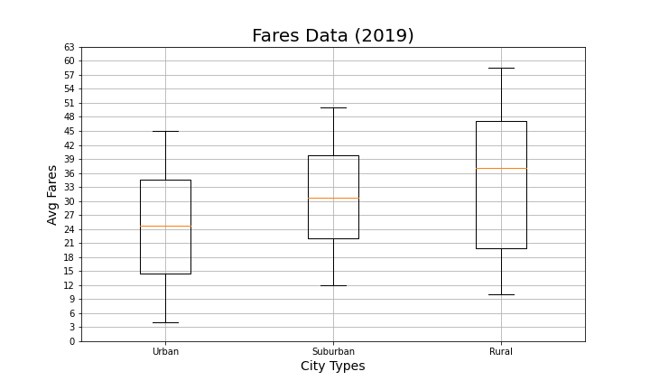

                                                                                           Michelle Werner (5/8/2022)
# Pyber Ride Share Analysis
---

<!---->

Pictured: Welcome to PyBer

# Analysis Overview:
As the a new data analyst at PyBer, a ridesharing app company, my first assignment was to do an exploratory analysis of PyBer's driving data, and specifically: isolating different types of cities (urban, suburban, and rural) and invesitgating differences in average fare price, driver number, etc. 

This assignment also included showcasing the results by telling a compelling story about the type of city and the number of drivers and riders, and fare totals and averages, through a variety of visualizations and charts.

My final analysis should help stakeholders determine how to improve access and affordability for underserved areas.

## Initial Results:

 <--
    
    -->

## Additional Analysis & Summary Data:

---
# Recommendations:

