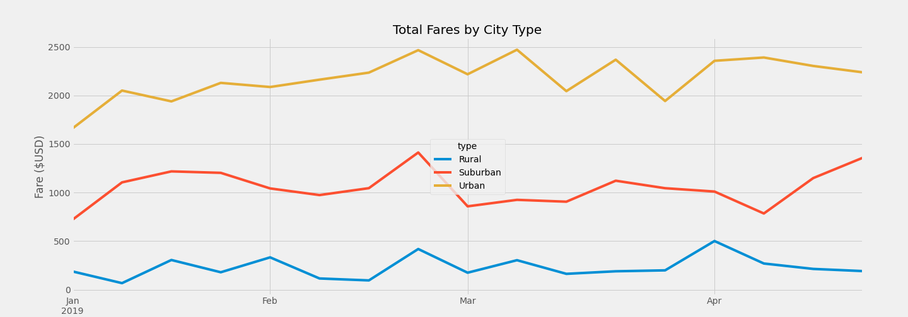

                                                                                           Michelle Werner (5/8/2022)
# Pyber Ride Share Analysis
---

<!---->

Pictured: Welcome to PyBer

# Analysis Overview:
As the a new data analyst at PyBer, a ridesharing app company, my first assignment was to do an exploratory analysis of PyBer's driving data, and specifically to isolate different types of cities (urban, suburban, and rural) and invesitgate differences in number of rides, number of drivers, average fare price, etc. 

This assignment also included showcasing the results by telling a compelling story about the data for each type of city, visualizing the number of drivers and riders, and fare totals and averages, through a variety of charts and graphs.

My final analysis should help stakeholders determine how to improve access and affordability for underserved areas.

## Initial Results:
To target findings to address the main comparison goals, intially data was separated into three new datasets: one for urban areas, one for suburban areas, and one for rural.  This initial separation revealed stark differences immediately and was especially obvious when charted in a scatter plot:
 

 
Figure 1: Scatter plot illustrating type of fare, plotted with size relevant to ride numbers and a y-axis location representing fare price, color-coded to city type.

Box and whisker charting and pie options were also visualized. Figures 2, 3, 4, directly below, show Ride Count ranges by city type, Driver Count ranges by city type, and Fare ranges by city type:

Figures 2, 3, 4 (above)

Figures 5, 6, 7 (above)

Pie chart figures 5, 6, and 7 directly above, show percentages of: Total Rides by city type, Total Drivers by city type and Total Fares by city type.

In all of the data analyzed, it is clear that rural users are paying far highter fare rates than urban users - but that urban users are so much higher in number and in frequence of use, that the majority of the fares are coming from urban users.

<!---img src="https://github.com/miwermi/pyber-analysis/blob/main/resources/Fig2.png" width="300" height="180" alt ="graphic: PyBer Welcome">

<!---img src="https://github.com/miwermi/pyber-analysis/blob/main/resources/Fig5.png" width="300" height="180" alt ="graphic: PyBer Welcome">

## Additional Analysis & Summary Data:
After the initial analysis was complete, additional requests were made for summary data of the total rides, drivers, sum of fares, and average fare per city and driver.  Figure 8 below has these results:

 
Figure 8. Summary dataset with totals by city type.

Pictured: Ride data from January-April, 2019
  

 
Figure 9. Line chart of fare prices for all city types between January through April, 2019.

---
# Recommendations:
Data analysis clearly shows the disparity between city types.  Rural areas, most likely travelling farther distances, are seeing very high average fare prices, while city trips are likely short and therefore less expensive.  Some new business model must be developed if PyBer wishes to gain favorable rural use. Perhaps a membership pricing discount (for rural users wishing to travel to the city on a regular basis) could be put in place for all PyBer users, that would help to spread the cost around - or - PyBer might add an option to the app to have rideshare groups, where users could regularly travel with others in their area, sharing the cost between them, by planning trips ahead of time. Another option might be to add a feature to the app to "donate" a ride (or portion of a ride) to users - city, suburban, or rural - who may not be using PyBer due to financial hardship. Rider profiles could then apply for sliding scale rates and the donations could offset costs for those in neeed.

If PyBer would like to serve all of these areas with a favorable reputation and continued growth and prosperity, surely some of these and other options could be proposed in focus groups or even through a survey on the app.  Possbily people in the PyBer community might also have feedback and suggestions.

